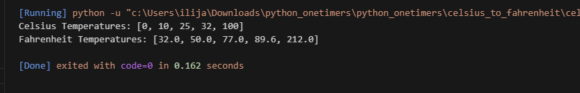

# Celsius to Fahrenheit Converter

This Python script converts a predefined list of Celsius temperatures into their Fahrenheit equivalents using the standard conversion formula:
    F = (celsius * 9/5) + 32

It then prints both the original Celsius temperatures and the converted Fahrenheit temperatures.

---

## 📜 How It Works

1. A list of Celsius temperatures is predefined.
2. The program loops through each Celsius value.
3. Each temperature is converted to Fahrenheit.
4. Both lists are displayed in the console.

---

## 💻 Code Example

celsius_temperatures = []  # Start with an empty list
fahrenheit_temperatures = []

celsius = [0, 10, 25, 32, 100]
celsius_temperatures = celsius

for celsius in celsius_temperatures:
    fahrenheit = (celsius * 9/5) + 32
    fahrenheit_temperatures.append(fahrenheit)

# Print both lists
print("Celsius Temperatures:", celsius_temperatures)
print("Fahrenheit Temperatures:", fahrenheit_temperatures)
▶️ Example Output

Celsius Temperatures: [0, 10, 25, 32, 100]
Fahrenheit Temperatures: [32.0, 50.0, 77.0, 89.6, 212.0]
🖼️ Screenshot

📌 Requirements
Python 3.x

🚀 How to Run:

Navigate to the script’s folder:

python celsius_to_fahrenheit.py