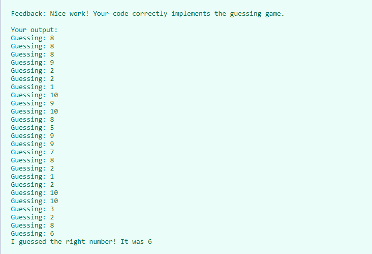

# Guess the Number 🎯

This is a simple Python script where the computer randomly guesses numbers between 1 and 10 until it finds the correct one.

## 📌 How It Works

- A secret number (between 1 and 10) is manually set by the developer.
- The program randomly generates guesses using `random.randint()`.
- It keeps guessing in a loop until it matches the secret number.
- Each guess is printed to the console.
- When the correct number is guessed, the program ends with a success message.

## 💡 Example Output

Guessing: 3
Guessing: 8
Guessing: 1
Guessing: 7
Guessing: 6
I guessed the right number! It was 6

## 🖼️ Output Screenshot

## 🚀 How to Run

Make sure you have Python installed. Then run the script using:

python ng_game.py

🧠 What You Learn: 

>> while loops<<

Using random to generate random numbers

Comparison operators (!=)

Console output using print()