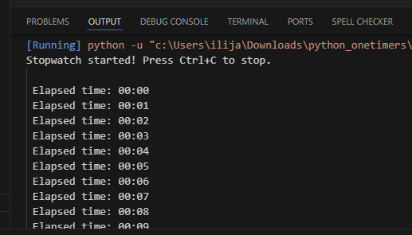

# Python Stopwatch ⏱️

This is a simple Python stopwatch script that lets you measure elapsed time in minutes and seconds.  
The stopwatch runs in the terminal and can be stopped manually with **Ctrl+C**.

---

## 📌 Features
- Displays elapsed time in `MM:SS` format.  
- Updates every second on the same line.  
- Stops cleanly with **Ctrl+C**.  
- Beginner-friendly and lightweight (uses only Python's built-in `time` module).

# Output screenshot

## 📝 Code Explanation
1. **Import `time`** – we use it to track the start time and pauses.
2. **Start time** – `start = time.time()` saves the moment the stopwatch begins.
3. **Loop forever** – `while True` keeps the stopwatch running until manually stopped.
4. **Elapsed time** – `elapsed = int(time.time() - start)` calculates seconds since start.
5. **Convert to minutes and seconds** – `mins, secs = divmod(elapsed, 60)`.
6. **Format output** – `print(f"\r Elapsed time: {mins:02d}:{secs:02d}", end="")` overwrites the same line.
7. **Sleep** – `time.sleep(1)` ensures updates every second.
8. **KeyboardInterrupt handling** – when you press **Ctrl+C**, the script exits gracefully and shows the final time.
