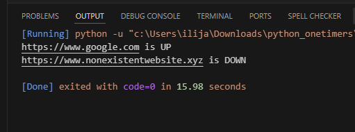

# Website Status Checker 🌐

A simple Python script that checks whether a given website is **UP** (responding with status code 200) or **DOWN**.  
It uses the [`requests`](https://pypi.org/project/requests/) library to send HTTP requests.

---

## 📌 Features
- Checks if a website is reachable.
- Returns **UP** if the status code is `200`.
- Returns **DOWN** if the status code is not `200` or if the site is unreachable.
- Handles exceptions gracefully (e.g., invalid domain or timeout).

# Output screenshot

## 📝 Code Explanation
1. **Import `requests`** – used for sending HTTP GET requests.
2. **Define `check_site(url)`**:
   - `requests.get(url, timeout=5)` tries to reach the site with a timeout of 5 seconds.
   - If `status_code == 200`, the site is **UP**.
   - Otherwise, it prints the site is **DOWN**.
   - Any exception (e.g., DNS error, timeout) is caught and handled as **DOWN**.
3. **Test Cases**:
   - `"https://www.google.com"` → should return **UP**.
   - `"https://www.nonexistentwebsite.xyz"` → should return **DOWN**.
